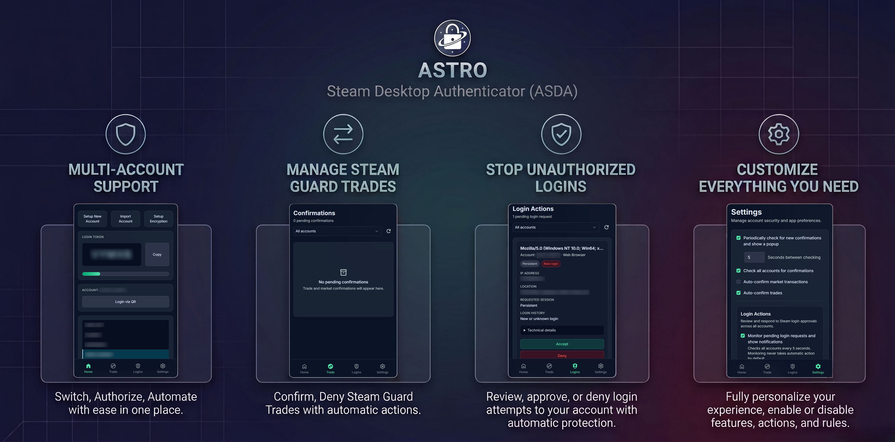

<h1 align="center">
  
  <br/>
  Astro Steam Desktop Authenticator
</h1>

<p align="center">
  A modernized, actively maintained continuation of the Steam Desktop Authenticator app. Manage your Steam Guard 2FA, trade confirmations, and secure your account right from your desktop.
</p>

<p align="center">
  <a href="https://github.com/AstroZer01/Astro-Steam-Desktop-Authenticator/releases/latest">
    
  </a>
</p>

<p align="center">
  
  
  
  
</p>

<p align="center">
  
</p>

## About This Project
This is a continuation of the original [Steam Desktop Authenticator](https://github.com/Jessecar96/SteamDesktopAuthenticator) created by **Jessecar96**. Astro Steam Desktop Authenticator is an actively maintained fork that serves to keep the desktop authenticator tool functional, secure, and compatible with Steam's modern API changes. 

A reliable way to manage **Steam Guard**, handle **2FA (Two-Factor Authentication)**, and automatically accept or decline **trade confirmations** directly on you're pc without using a mobile phone.
All credit for the original design and implementation goes to Jessecar96 and the original contributors.

## Key Features

- **Steam Guard codes and account management** — view, copy, and manage Steam Guard authenticators for multiple accounts.
- **Phone-free authenticator setup** — add an authenticator without entering a phone number when Steam allows it. If Steam requires phone verification for the account, the app clearly guides you through the email and SMS steps instead.
- **Trade confirmations** — review and accept or decline pending confirmations across managed accounts.
- **Login approvals** — review Steam login requests with device and location details, then approve or deny them manually. Optional account-wide rules can automatically approve persistent sign-ins or deny requests, with IP allowlisting controls.
- **Proxy Support** — Use proxy when communicating with steam.
- **Desktop notifications** — receive Windows notifications for pending trade confirmations and login requests, with navigation back to the relevant view.

## Version 1.1.2 Highlights

- **Phone-free Steam Guard setup** - Add an authenticator without a phone number when Steam allows it, with clear email and SMS guidance when verification is required.
- **Smoother account setup** - Improved phone verification, recovery-code downloads, and account-management controls.
- **More reliable Steam actions** - Better handling for login approvals, trade confirmations, session refreshes, and temporary Steam errors.
- **Safer updates** - Portable releases preserve your existing accounts and settings when you update.

For a complete list of changes, see the [1.1.2 release notes](https://github.com/AstroZer01/Astro-Steam-Desktop-Authenticator/releases/tag/1.1.2).

## Build from Source on Windows

The committed UI assets are included in a normal .NET publish, so Node.js is not required for an ordinary release build.

### Prerequisites

- Windows 10 or later, 64-bit
- **[.NET 8 SDK](https://dotnet.microsoft.com/download/dotnet/8.0)**

To run the built application, install the .NET 8 Desktop Runtime if the SDK is not installed, and install the [Microsoft Edge WebView2 Runtime](https://developer.microsoft.com/microsoft-edge/webview2/#download-section).

### Build a release package from Command Prompt

1. Clone the repository and open the cloned folder:

   ```powershell
   git clone https://github.com/AstroZer01/Astro-Steam-Desktop-Authenticator.git
   cd Astro-Steam-Desktop-Authenticator
   ```

2. From the repository root, run this command in Command Prompt:

   ```bat
   dotnet publish "Launcher\Launcher.csproj" -c Release -r win-x64 --self-contained false -p:PublishSingleFile=true -p:IncludeNativeLibrariesForSelfExtract=false -p:PublishTrimmed=false -p:EnableCompressionInSingleFile=false -p:DebugSymbols=false -o "publish\ASDA"
   ```

   Close any copy of the app running from that folder before rebuilding so Windows can replace its executable. `dotnet publish` restores the required Windows x64 dependencies automatically and preserves an existing root `publish\ASDA\maFiles` folder.

3. When `dotnet publish` completes successfully, start:

   ```text
   publish\ASDA\Steam Desktop Authenticator.exe
   ```

Keep the complete `publish\ASDA` folder together in a folder your Windows account can write to; do not install this portable package under `Program Files`. The root executable is the Launcher; it starts the real app from `publish\ASDA\bin`. The `bin` folder contains the WebView files and runtime dependencies, while the application creates `publish\ASDA\maFiles` beside the Launcher on first launch. Back up that `maFiles` folder securely.

<details>
<summary><h3>Build script</h3></summary>

Save this as a `.bat` file. Set `PROJECT_ROOT` to the repository root and `OUTPUT` to the directory where you want the portable application built. The script preserves existing output data while rebuilding.

```bat
@echo off
setlocal EnableExtensions
title Build Astro Steam Desktop Authenticator

set "PROJECT_ROOT="
set "OUTPUT="

cd /d "%PROJECT_ROOT%" || goto :failed

dotnet clean "SteamDesktopAuthenticator.sln" -c Release || goto :failed
dotnet publish "Launcher\Launcher.csproj" -c Release -r win-x64 --self-contained false -p:PublishSingleFile=true -p:IncludeNativeLibrariesForSelfExtract=false -p:PublishTrimmed=false -p:EnableCompressionInSingleFile=false -p:DebugSymbols=false -o "%OUTPUT%" || goto :failed

del /q "%OUTPUT%\*.pdb" "%OUTPUT%\*.xml" "%OUTPUT%\*.config" 2>nul
del /q "%OUTPUT%\bin\*.pdb" "%OUTPUT%\bin\*.xml" "%OUTPUT%\bin\*.config" 2>nul

echo.
echo Compilation finished:
echo %OUTPUT%
pause
exit /b 0

:failed
echo.
echo Compilation failed. Close any running copy of the app and try again.
pause
exit /b 1
```

The build does not touch the manifest or `.maFile` files. When building or working on the project, make a secure backup of `manifest.json` and the `maFiles` folder so no data is lost. If you plan to commit to this repository, never include a manifest or `.maFile` file: they can expose account credentials and authenticator secrets.

</details>

<details>
<summary><h3>Build with Visual Studio 2022</h3></summary>

1. Open `SteamDesktopAuthenticator.sln`.
2. Select the `Release` configuration.
3. In Solution Explorer, right-click **Launcher** — not **Steam Desktop Authenticator** — then choose **Publish**.
4. Select a **Folder** target. Use `publish\ASDA` as the target location and select **Windows x64** with **Framework-dependent** deployment.
5. In publish settings, enable **Produce single file** and leave trimming disabled, then select **Publish**.

Visual Studio's regular **Build** command places development output under `bin`; use **Publish** when you want the portable release folder described above.

</details>

### UI stylesheet for contributors

The WebView UI ships with committed, local CSS and fonts. Normal .NET builds use the committed `ui/assets/css/app.css` and do not require Node.js.

After changing an HTML template, `tailwind.config.js`, or `ui/tailwind-input.css`, install **[Node.js 22 LTS](https://nodejs.org/)** and run:

```powershell
npm ci # once after cloning or when package-lock.json changes
npm run build:ui
```

Commit the resulting `Steam Desktop Authenticator/ui/assets/css/app.css` with the UI change.

- `npm run build:ui` regenerates `Steam Desktop Authenticator/ui/assets/css/app.css`.
- `npm run check:ui` regenerates the stylesheet and fails if the generated file was not committed.

The hook runs only when staged UI templates, the Tailwind configuration, or the Tailwind input stylesheet change. CI verifies the same invariant, and the release workflow regenerates the stylesheet before publishing.


<p align="center">
  ❕ Alternatively, download and run the latest release without building from source.<br>
  <a href="https://github.com/AstroZer01/Astro-Steam-Desktop-Authenticator/releases/latest">
    
  </a>
</p>


## Current Focus & To-Do

### To-Do List

#### In Progress / Remaining
- [ ] API endpoint for trading automation

## Disclaimer
We provide no warranty for using this tool. You use this program at your own risk, and accept the responsibility to make backups of your `maFiles` (which contain your 2FA secrets) and prevent unauthorized access to your computer.

**Notice:** Astro Steam Desktop Authenticator is an unofficial tool and is not affiliated with, endorsed by, or associated with Valve Corporation or the official Steam Guard in any way.
